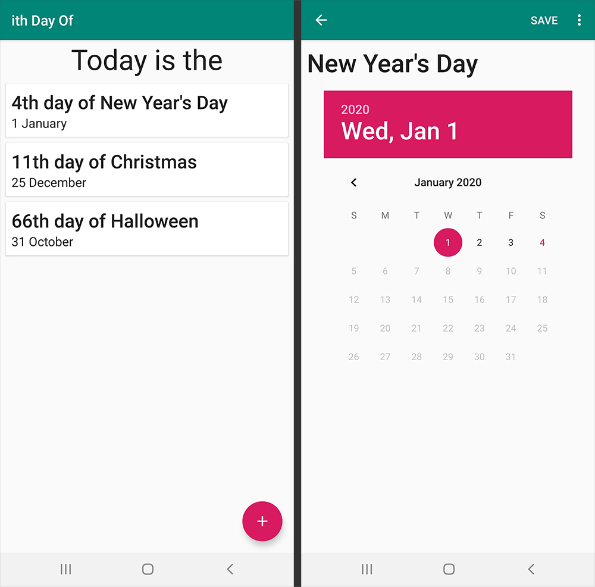

# ith Day Of

ith Day Of is an Android app that keeps track of the number of days since a user-entered day. Like
[Room Notes](https://github.com/jaradgray/RoomNotes),
it uses
[AndroidX](https://developer.android.com/jetpack/androidx/)
libraries and
[Android architecture components](https://developer.android.com/topic/libraries/architecture/)
to implement the
[recommended app architecture](https://developer.android.com/jetpack/docs/guide#recommended-app-arch).

## Featured Components

Like
[Room Notes](https://github.com/jaradgray/RoomNotes),
ith Day Of features the following Android components:

- [ViewModel](https://developer.android.com/topic/libraries/architecture/viewmodel)
and
[LiveData](https://developer.android.com/topic/libraries/architecture/livedata)
to separate UI from business logic
- [Room](https://developer.android.com/training/data-storage/room/index.html)
persistence library for on-device database storage
- [RecyclerView](https://developer.android.com/guide/topics/ui/layout/recyclerview#structure)
to present database data to the user

## What I Learned

- How to use the DatePicker widget
- More familiarity with local data persistence via Room

## Inspiration

The idea of ith Day Of came from the following Instagram post:

